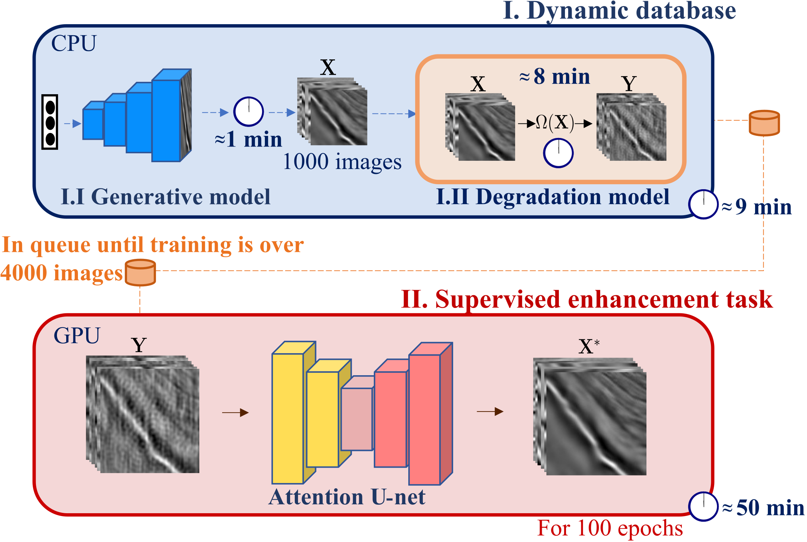

# Post-stack Seismic Data Preconditioning via Dynamic Guided Learning

This is the official implementation of the paper **Poststack Seismic Data Preconditioning via Dynamic Guided Learning** [arXiv](https://arxiv.org/abs/2502.00887). This work introduces a dynamic guided learning workflow that utilizes a dynamic database to generate both clean and noisy patches during training. This database guides the learning process for a supervised enhancement task, improving generalization by reducing reliance on specific known distributions. As a result, the method eliminates the need for external datasets while enhancing generalization and adaptability.

**Proposed method**



<div style="text-align: justify"> 
<b>Figure 1.</b> The dynamic guided learning workflow with two main processes: (I) the dynamic database that generates <b>X</b> poststack seismic data using the generative model (1000 patches) and <b>Y</b> noisy poststack seismic data (4000 patches) using the degradation model containing 12 different types of noise. (II) The supervised enhancement task learns distinctive features of poststack seismic data during training. While process (II) is training, process (I) generates the next batch of images with different types of noise randomly selected, completing one cycle, with (I) in CPU and (II) in GPU to maximize computational efficiency.
</div>

<hr/>

**How to use**

To install the project packages, you can use Anaconda.
```
conda env create -f environment.yml
```
or python.
```
pip install -r requirements.txt
```


**Metrics**

PSNR (dB) and SSIM metrics across different simulated types of noise for enhancement methods, including the median filter, DIP, S2S-WTV, and Baseline. **Bold text** indicates the best result, while <u>underlined</u> text highlights the second-best.

| Noises              | SSIM (Medial filter) | PSNR (Medial filter) | SSIM (DIP) | PSNR (DIP) | SSIM (S2S-WTV) | PSNR (S2S-WTV) | SSIM (Baseline) | PSNR (Baseline) | SSIM (Proposed) | PSNR (Proposed) |
|---------------------|---------------------|---------------------|------------|------------|---------------|---------------|---------------|---------------|---------------|---------------|
| Gaussian           | 0.783               | 22.947              | <u>0.965</u>    | <u>31.992</u>   | 0.952         | 29.021        | 0.975         | 31.658        | **0.985**     | **33.457**     |
| Poisson            | 0.784               | 22.899              | <u>0.961</u>    | <u>31.997</u>   | 0.952         | 28.493        | 0.974         | 31.291        | **0.986**     | **34.248**     |
| Speckle            | 0.563               | 15.787              | <u>0.908</u>    | <u>27.273</u>   | 0.781         | 16.804        | 0.807         | 19.370        | **0.934**     | **27.336**     |
| Salt and pepper    | 0.712               | 20.833              | <u>0.881</u>    | <u>28.028</u>   | 0.731         | 20.742        | 0.825         | 22.551        | **0.992**     | **35.922**     |
| Linear             | 0.560               | 18.867              | <u>0.947</u>    | <u>29.238</u>   | 0.839         | 23.620        | 0.926         | 26.580        | **0.994**     | **36.859**     |
| Waves              | 0.770               | 22.124              | 0.957      | 30.986     | 0.949         | 27.884        | <u>0.976</u>       | <u>31.602</u>      | **0.991**     | **35.319**     |
| Stripes            | 0.633               | 18.838              | <u>0.964</u>    | <u>32.717</u>   | 0.798         | 20.687        | 0.948         | 25.201        | **0.998**     | **39.361**     |
| Correlated g₁      | 0.782               | 22.774              | 0.944      | <u>29.538</u>   | 0.934         | 27.272        | <u>0.965</u>       | 29.442        | **0.972**     | **31.108**     |
| Correlated g₂      | 0.784               | 22.923              | 0.950      | <u>31.654</u>   | 0.942         | 28.509        | <u>0.978</u>       | 31.001        | **0.987**     | **34.262**     |
| Blur               | 0.516               | 17.400              | **0.904**  | **30.426** | 0.550         | 17.707        | 0.600         | 19.085        | <u>0.901</u>       | <u>27.337</u>       |
| Correlated g₁₂     | 0.796               | 23.124              | <u>0.954</u>    | <u>31.062</u>   | 0.953         | 28.775        | 0.981         | 31.271        | **0.984**     | **33.593**     |
| g₁₂ blur          | 0.683               | 19.403              | <u>0.948</u>    | <u>30.456</u>   | 0.770         | 20.496        | 0.851         | 22.129        | **0.981**     | **31.543**     |

# Citation
If you find the Dynamic Guided Learning useful in your research, please consider citing:

```
@misc{torresquintero2025poststackseismicdatapreconditioning,
      title={Poststack Seismic Data Preconditioning via Dynamic Guided Learning}, 
      author={Javier Torres-Quintero and Paul Goyes-Peñafiel and Ana Mantilla-Dulcey and Luis Rodríguez-López and José Sanabria-Gómez and Henry Arguello},
      year={2025},
      eprint={2502.00887},
      archivePrefix={arXiv},
      primaryClass={physics.geo-ph},
      url={https://arxiv.org/abs/2502.00887}, 
}
```